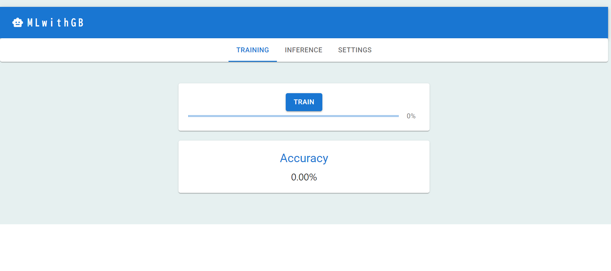
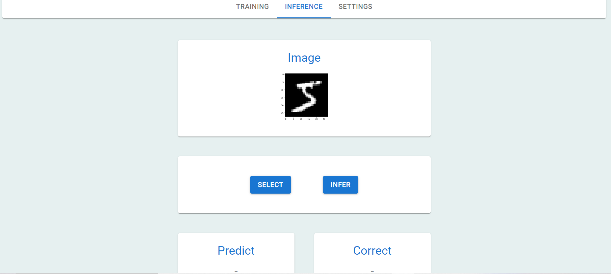
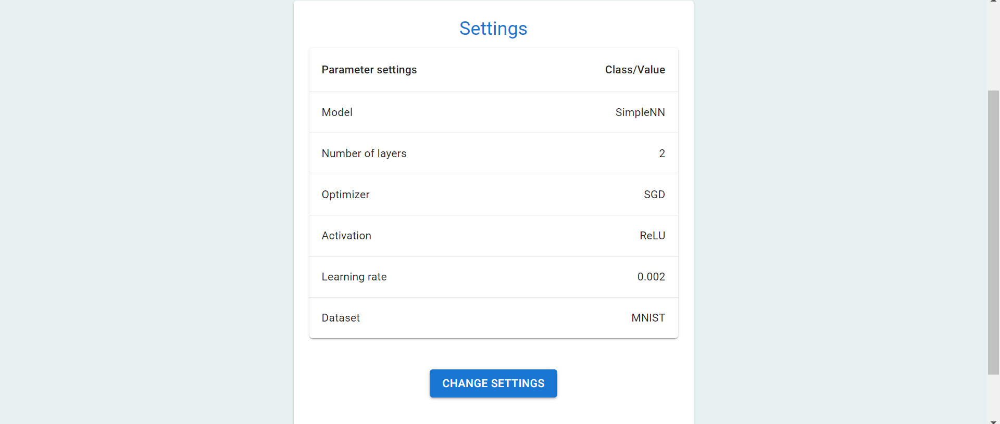
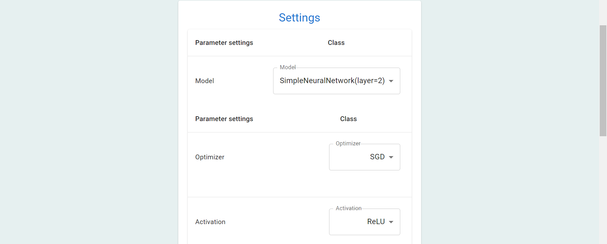
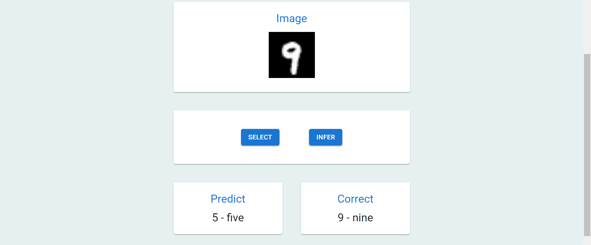
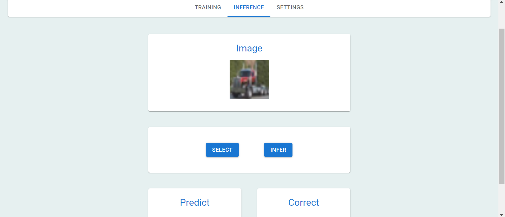

# Getting Started with MLwithGB

## はじめに

MLwithGB(Machine Learning with GraphicsBoard)はディープラーニングをGUI風に体感する事が出来るWebアプリケーションです。

### 使用した言語・主要フレームワーク

+ フロントエンド(JavaScript)

  React, MUI(Material-UI)

+ バックエンド(Python)

  Flask, PyTorch

+ 環境

  Node.js: v18.16.0

  Python: 3.12.4

## インストール方法

前提としてNode.jsをインストールしておく必要があります。

1. このレポジトリを手元のローカル環境にクローンします。
   ```
   git clone https://github.com/y929Komi/MLwithGB.git
   ```

2. 必要なライブラリなどをインストールします。
   ```
   pip install -r requirements.txt
   ```
   
   ```
   npm install @mui/material @emotion/react @emotion/styled @mui/icons-material
   ```

3. `mlwithgb`ディレクトリに移動します。
   
4. `npm install`を実行します。
   
5. `npm start`を実行します。
   
6. 以下のコマンドを実行します。

   ```
   cd src/backend
   ```

   ```
   python server.py
   ```

## チュートリアル

### 機能について

このアプリでは以下の事が出来ます。

+ 深層学習モデルの学習

+ 学習前・学習済みモデルを用いた推論

また学習・推論の際に以下の項目を変更する事が出来ます。

+ 学習モデルの変更

  + 現在は単純な2層のNNおよび4層からなるCNN(畳み込みニューラルネットワーク)を選択することが出来ます。

+ データセットの変更

  + 現在はMNISTおよびCIFAR-10の2種類から選択することが出来ます。

+ 一部ハイパーパラメータの変更・調整

  + 最適化アルゴリズム、活性化関数、学習率の変更が可能です。

### 使い方

アプリを起動すると以下のような画面になります。




+ 学習メニュー

  Trainのボタンを押す事で設定した項目に従ってモデルの学習が始まります。

  ゲージが100%になった時点で学習が完了します。

+ 推論メニュー
  
  

  SELECTボタンを押すとテストデータの中から画像が1枚ランダムに選択されます。

  INFERボタンを押すと選択された画像がモデルに入力され、予測(Predict)と正解(Correct)がそれぞれ表示されます。

  + モデルの学習前に推論を行った場合

    重みが初期値のモデルで画像を推論します。

  + モデルの学習後に推論を行った場合

    学習済みモデルで画像を推論します。

+ 設定メニュー

  この画面では現在の設定値が表示されています。

  

  下のCHANGE SETTINGSボタンを押す事で以下の設定画面に遷移します。

  

  設定項目は以下の通りです。

  + model
    
    モデルを選択します。現在選択できるモデルは以下の通りです。デフォルトではSimpleNeuralNetworkが選択されています。
    
    + SimpleNeuralNetwork(2層の単純なNN)
    
    + SimpleConvNet(2層の畳み込み層および2層の全結合層からなるCNN)
  
  + Optimizer

    学習時の最適化アルゴリズム(Optimizer)を選択します。デフォルトではSGDが選択されています。

    + SGD

    + Adam

    + AdaGrad

  + Activation

    モデルの活性化関数を選択することが出来ます。デフォルトではReLUが選択されています。

    + ReLU

    + Sigmoid

    + htanh(hard tanh)

  + Dataset

    学習や推論を行うデータセットを選択します。現在は以下の2つから選択することが出来ます。(デフォルトではMNISTが選択されています。)

    + MNIST
  
    

    + CIFAR-10
  
    

  + Learning rate

    学習率の設定を行います。デフォルトでは0.002に設定されています。

## ライセンス

+ MIT License

## Contact

Github:https://github.com/y929Komi